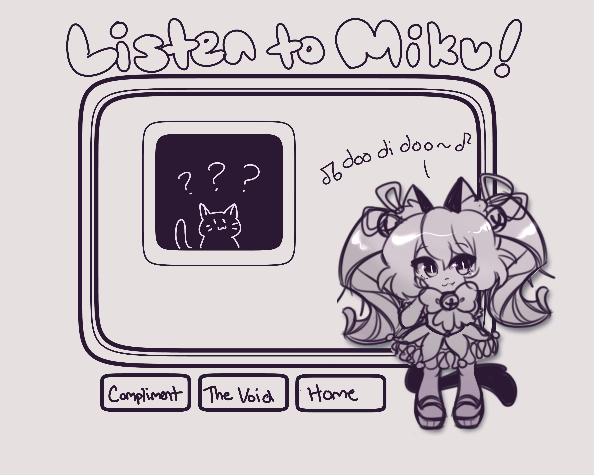
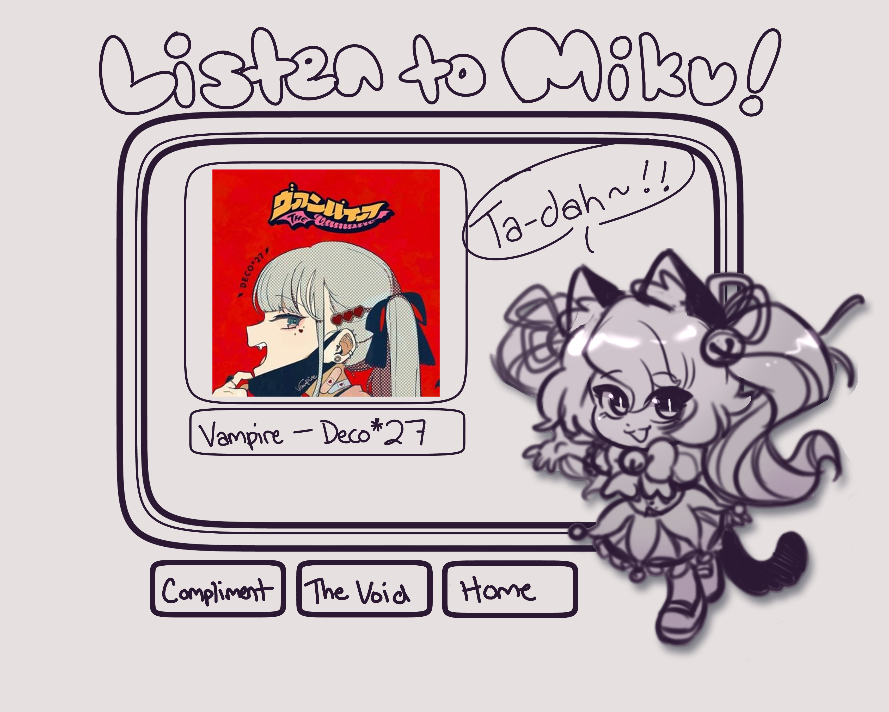
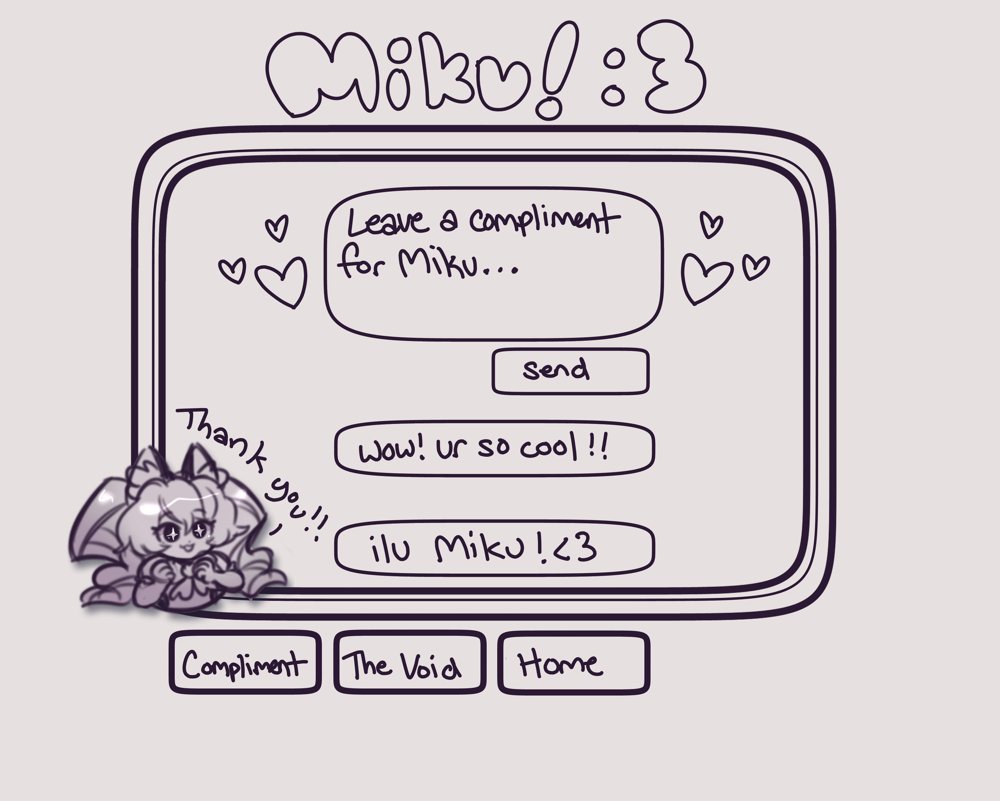
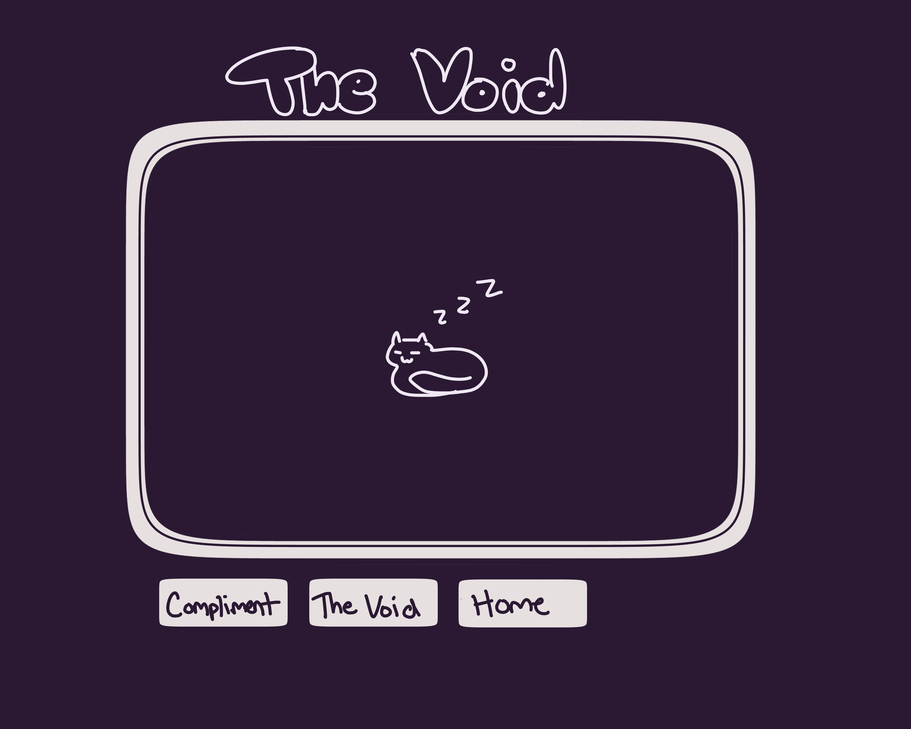

# Listen to Miku

## Overview

This app is just a silly little thing that lets the user flip through Hatsune Miku's Spotify discography, as well as leave behind encouraging comments for the virtual idol!

### Problem Space

Essentially this app exists purely for fun! I do not really have any problems I wish to fix with it, and my only intention is to explore implementing some of the many new things that I have learned during my time with BrainStation. Other than that maybe it can introduce users to new songs or just to Hatsune Miku in general which is always a plus!

### User Profile

Hatsune Miku fans, and really anyone that likes cute things or finding new music!

### Features

- As a user, I want to see Miku fanart
- As a user, I want to click the image of miku and be randomly generated a Spotify song from her discography
- As a user, I want to be able to leave kind messages on the comment board
- As a user, I want to be able to switch between a Halloween theme and a different theme

## Implementation

### Tech Stack

- React
- Express
- MySQL
- Client libraries:
    - react
    - react-router
    - axios
- Server libraries:
    - knex
    - express

### APIs

- Spotify API

### Sitemap

List the pages of your app with brief descriptions. You can show this visually, or write it out.

- Home page (Idle)
- Home page (Active)
- Comment page
- The Void page

### Mockups

#### Home Page (Idle)

#### Home Page (Active)

#### Coment Page

#### The Void

### Data

Describe your data and the relationships between the data points. You can show this visually using diagrams, or write it out. 

### Endpoints

List endpoints that your server will implement, including HTTP methods, parameters, and example responses.

## Roadmap

Scope your project as a sprint. Break down the tasks that will need to be completed and map out timeframes for implementation working back from the capstone due date. 

---

## Future Implementations
Your project will be marked based on what you committed to in the above document. Here, you can list any additional features you may complete after the MVP of your application is built, or if you have extra time before the Capstone due date.

